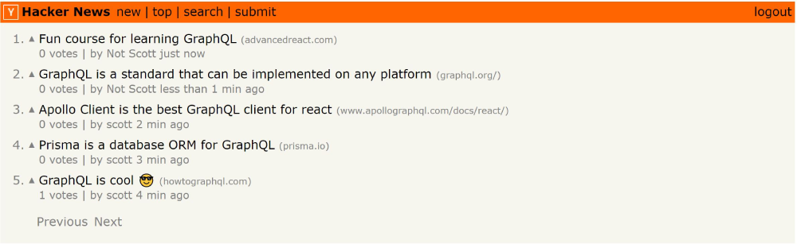
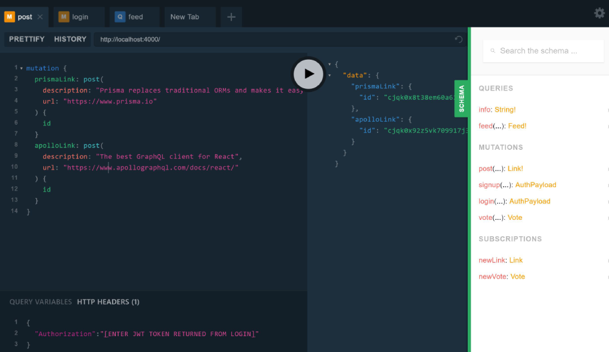

# Hacker News GraphQL React Clone

[howtographql.com](https://howtographql.com)

Frontend:

- React
- Apollo Client, local caching updates, subscriptions, etc.
- JWT Authentication

Backend:

- generated Prisma client with demo DB
- Yoga GraphQL Server
- Subscriptions, Mutations, Queries

